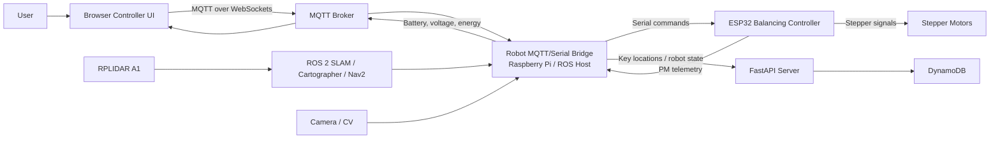
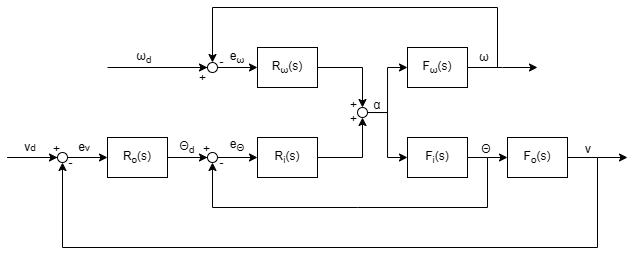
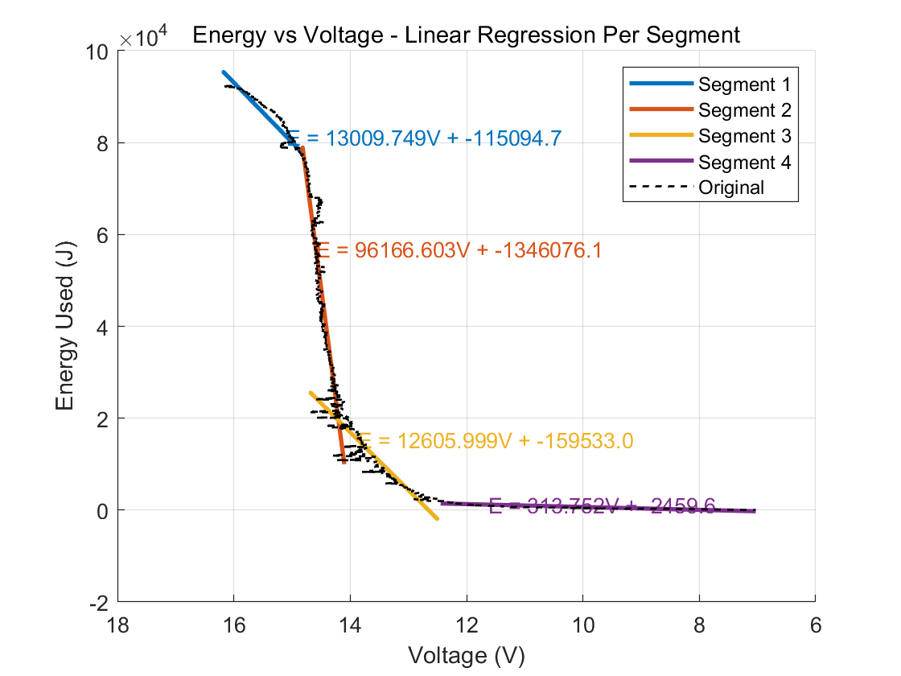

# Aenertia

<p align="center">
  
</p>

Aenertia is an EE2 balancing robot project designed for indoor assistance. The robot combines a two-wheel self-balancing controller, a browser-based controller UI, MQTT communication, ROS 2 navigation with RPLIDAR mapping, human-following experiments, and battery/power monitoring.

The long-term aim is to guide users through a previously mapped indoor area, remember useful locations, follow a person when requested, and return autonomously to saved key locations.

## Project Goals

- Balance on two wheels while accepting manual acceleration and steering commands.
- Provide a web controller for manual driving, PID tuning, autonomous modes, and telemetry.
- Use MQTT to connect the UI, Raspberry Pi, ESP32 motor controller, and robot functions.
- Map indoor spaces using RPLIDAR with ROS 2 SLAM tools.
- Save and return to key locations using ROS 2 pose data and Nav2 goals.
- Monitor battery voltage, power use, and estimated remaining battery percentage.

## System Overview

The project is split across embedded control, robot-side services, web UI, cloud/database utilities, and power-monitoring code:



| Area | Folder | Purpose |
| --- | --- | --- |
| Balancing controller | `Control/`, `ControlCodeBot1/`, `ControlCodeBot2/` | ESP32/PlatformIO firmware for self-balancing, stepper control, serial commands, and telemetry output. |
| Controller UI and communication | `UI_And_Communication/` | Browser dashboard using HTML, CSS, JavaScript, and MQTT over WebSockets. |
| Robot functions | `Robot_Functions/ROS2/` | ROS 2 workspace, RPLIDAR launch files, Cartographer/SLAM, Nav2 helpers, pose saving, and MQTT-to-serial bridge. |
| Power monitoring | `PowerMonitoring/` | ESP32/ADC current and voltage monitoring, battery plots, and server-side energy calculations. |
| Server and database | `server/` | FastAPI routes, DynamoDB helpers, PID value storage, robot state updates, and key-location storage. |
| Logbooks | `Logbooks/` | Design notes, setup guides, circuit images, RPLIDAR notes, and development records. |

## PID Control System



The balancing firmware runs a cascaded PID-style controller on the ESP32. It reads the MPU6050 accelerometer/gyroscope, filters the tilt estimate with a complementary filter, and drives two stepper motors through a timer interrupt.

The current control structure in `Control/src/main.cpp` uses:

- Outer speed loop: compares target speed with measured wheel speed and produces a target tilt angle.
- Inner tilt loop: compares target tilt with measured tilt and produces a motor acceleration command.
- Yaw/turn loop: compares target yaw rate with gyro yaw feedback and mixes turn output into left and right wheel acceleration.
- Stepper interrupt loop: calls the stepper update routine every `STEPPER_INTERVAL_US` microseconds.
- Serial command interface: receives commands such as `forward`, `backward`, `left`, `right`, combined diagonal commands, and `stop`.

The controller UI includes PID forms for the inner and outer loops. The JavaScript publishes PID updates to MQTT topics:

- `robot/pid/inner`
- `robot/pid/outer`

The server-side PID handler in `server/tuning/pid_handler.py` stores inner and outer loop gain updates through the DynamoDB helper layer.

## Controller UI

The web dashboard is in `UI_And_Communication/UI_communication/`.

It provides:

- Manual control tab with arrow-pad driving.
- PID values tab for inner-loop and outer-loop tuning.
- Autonomous tab with follow mode and return-to-key-location controls.
- Top telemetry bar for time, battery percentage, battery voltage, energy use, and MQTT connection status.
- Voice-command button that sends speech text to a local interpretation server.
- Key-location assignment and reset controls.

The UI connects to an MQTT broker over WebSockets and publishes/subscribes to robot topics. Manual control uses `robot/manual/command`, mode changes use `robot/mode`, autonomous actions use `robot/auto`, key locations use `robot/auto/key/assign` and `robot/goto_keyloc`, and telemetry is received on topics such as `robot/battery`, `robot/vb`, and `robot/eu`.

## Robot Functions

Robot-side functions are centred around the ROS 2 workspace in `Robot_Functions/ROS2/gbot_ws`.

### LIDAR, SLAM, and Navigation

The ROS 2 setup uses:

- RPLIDAR A1 for laser scan data.
- `rplidar_ros` for the LiDAR driver.
- Cartographer and/or SLAM Toolbox for mapping.
- A custom robot description package for URDF and TF.
- Nav2 goal publishing through `/goal_pose`.
- RViz2 for visualising TF, LaserScan, submaps, and the robot model.

Useful launch notes are documented in:

- `Robot_Functions/ROS2/ROS2_guide.md`
- `Robot_Functions/ROS2/Launch_Commands.md`
- `Logbooks/BB_Logbook/RPLIDAR_Guide.md`

Typical ROS 2 launch sequence:

```bash
cd ~/Aenertia/Robot_Functions/ROS2/gbot_ws
source install/setup.bash
ros2 launch mybot_description description.launch.py
```

```bash
cd ~/Aenertia/Robot_Functions/ROS2/gbot_ws
source install/setup.bash
ros2 launch rplidar_ros rplidar_a1_launch.py serial_port:=/dev/rplidar serial_baudrate:=115200 frame_id:=laser_frame
```

```bash
cd ~/Aenertia/Robot_Functions/ROS2/gbot_ws
source install/setup.bash
ros2 launch mybot_cartographer carto.launch.py
```

```bash
cd ~/Aenertia/Robot_Functions/ROS2/gbot_ws
source install/setup.bash
ros2 launch mybot_nav bringup.launch.py
```

### MQTT and Serial Bridge

The robot-side bridge in `Robot_Functions/ROS2/gbot_ws/src/mybot_nav/mybot_nav/mqtt_serial_bridge.py` connects the high-level UI and autonomy commands to the ESP32.

It handles:

- Connecting to the ESP32 over serial.
- Subscribing to MQTT command topics.
- Translating manual UI commands into ESP32 serial strings.
- Starting follow-me behaviour using computer vision pose detection.
- Reading power-monitoring messages from the ESP32.
- Publishing battery, voltage, and energy telemetry back to MQTT.
- Saving current map-frame poses as named key locations.
- Publishing Nav2 goals for return-to-location commands.

## Power Monitoring


Power monitoring is implemented in both firmware and server-side utilities. The ESP32 reads battery and current-sense channels through an external ADC over SPI, then emits JSON telemetry lines prefixed with `PM:`.

The integrated control firmware reports:

- `VB`: averaged battery voltage.
- `EU`: energy used during the reporting interval.

The robot-side MQTT bridge parses these serial messages, logs the values to CSV, estimates battery percentage, and publishes telemetry to:

- `robot/vb`
- `robot/eu`
- `robot/battery`

The `PowerMonitoring/` folder also contains separate test firmware, LCD output experiments, server-side calculations, CSV logs, and MATLAB plots used for battery modelling.



## Server and Data

The `server/` folder contains supporting backend code:

- `server/api.py` exposes a FastAPI route for storing key locations.
- `server/main.py` bridges ROS pose data into robot state updates and location history.
- `server/database/` contains DynamoDB helpers and tests for robot state, PID values, key locations, and location history.
- `server/tuning/pid_handler.py` stores updated PID parameters.
- `server/s3bucket/` contains S3 upload and presigned upload experiments.

Key locations can be saved from the UI, passed through MQTT, recorded from the current ROS TF pose, and stored through the FastAPI/DynamoDB layer.

## Getting Started

### Embedded Firmware

The ESP32 firmware projects use PlatformIO. Open one of the PlatformIO folders, connect the ESP32, then build and upload:

```bash
cd Control
pio run --target upload
```

Use `Control/` for the current integrated balancing firmware, and check `ControlCodeBot1/` or `ControlCodeBot2/` for alternate bot-specific versions and development history.

### MQTT Broker

Install and run Mosquitto on the robot or local network host. The UI expects a WebSocket broker, currently configured in `mqtt-control.js` as:

```text
ws://172.20.10.9:9001
```

The robot-side Python bridge connects to the local MQTT broker on port `1883`.

### Controller UI

Open the UI folder and serve or open the dashboard:

```bash
cd UI_And_Communication/UI_communication
```

Then open `index.html` in a browser. For full MQTT support, make sure the broker WebSocket address in `static/mqtt-control.js` matches the robot or broker IP address.

### Robot-Side Bridge

On the Raspberry Pi or ROS host:

```bash
cd Robot_Functions/ROS2/gbot_ws
source install/setup.bash
ros2 run mybot_nav mqtt_serial_bridge
```

The bridge will try common ESP32 serial ports, subscribe to MQTT topics, forward commands to the ESP32, and publish telemetry.

### Backend API

The FastAPI service can be run from the repository root:

```bash
uvicorn server.api:app --reload
```

This enables the `/store_key_location` endpoint used by the UI when key locations are received.

## Notes and Known Work

- Some UI strings and comments contain encoding artefacts from previous edits.
- IP addresses and serial device names are currently hard-coded in several places and may need editing for a new network or robot.
- ROS 2 setup notes mention both Humble and Jazzy; the current launch guide focuses on ROS 2 Jazzy.
- Follow-me mode and voice-command interpretation are experimental and depend on local camera, CV, MQTT, and Flask/OpenAI API setup.
- The logbooks contain the most detailed development context and should be checked before changing hardware, wiring, or ROS launch assumptions.

## Useful References

- `Logbooks/README.md` - project introduction and early communications notes.
- `Logbooks/BB_Logbook/BB_logbook.md` - MQTT and communication notes.
- `Logbooks/BB_Logbook/RPLIDAR_Guide.md` - RPLIDAR setup notes.
- `Robot_Functions/ROS2/Launch_Commands.md` - ROS 2 launch sequence.
- `UI_And_Communication/README.md` - UI/MQTT communication note.
- `PowerMonitoring/BatteryLog/` - battery and energy plots/logs.
